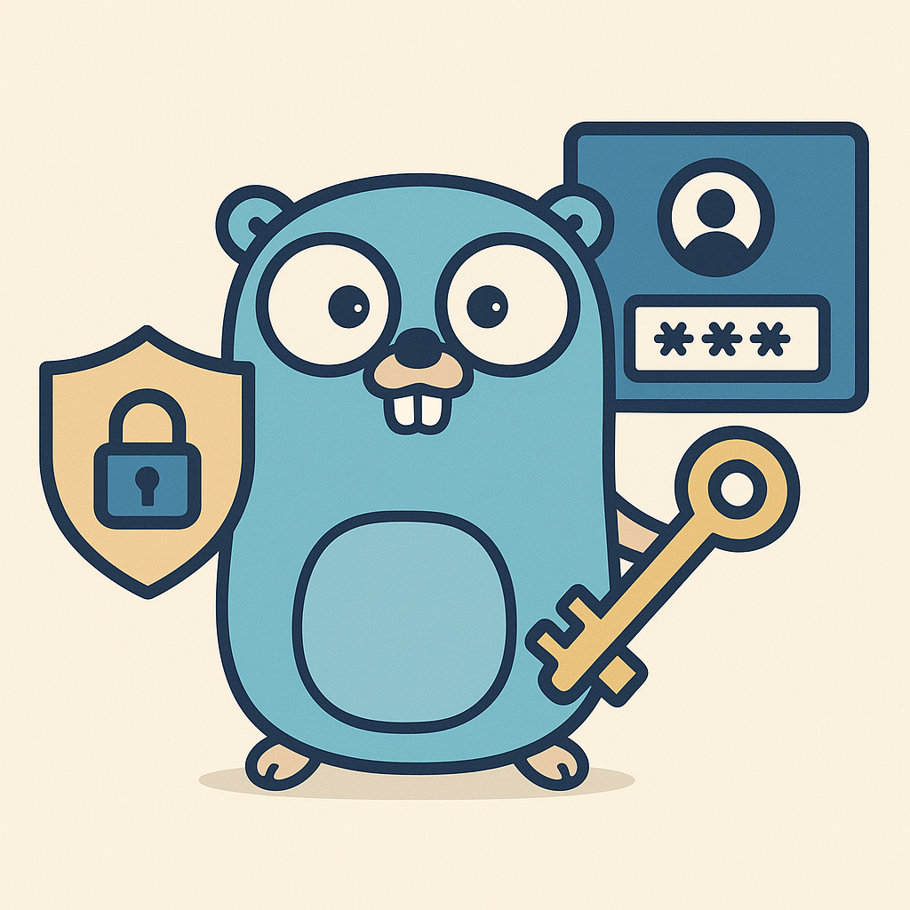

# Go IAM Website

The official website and documentation for **Go IAM** - a lightweight, multi-tenant Identity and Access Management (IAM) server built in **Golang**. This website provides comprehensive documentation, guides, and resources for implementing authentication and authorization in modern applications.

🌐 **Live Website**: [https://goiam.dev](https://goiam.dev)



---

## ✨ Features

### 📚 **Comprehensive Documentation**

- Getting started guides for different setup methods
- Multi-language SDK integration tutorials
- Step-by-step configuration instructions
- Real-world implementation examples

### 🛠️ **Multi-Language SDK Support**

- **Go** - Server-side applications
- **TypeScript** - Node.js and browser applications
- **Python** - Python applications with async support
- **Rust** - High-performance applications
- **React** - Frontend applications with hooks and components

### 🔧 **Setup Guides**

- Docker-based setup (recommended)
- Manual installation guide
- Client configuration tutorials
- Environment configuration examples

### 🎨 **Modern Design**

- Built with [Once UI](https://once-ui.com) design system
- Responsive design for all devices
- Fast loading with static site generation
- SEO optimized for search engines

---

## 🧰 Tech Stack

| Component  | Technology                     |
| ---------- | ------------------------------ |
| Framework  | Next.js 15 with App Router     |
| UI Library | [Once UI](https://once-ui.com) |
| Content    | MDX for documentation          |
| Styling    | Sass with Once UI tokens       |
| Deployment | [Vercel](https://vercel.com)   |
| Analytics  | Vercel Analytics               |

---

## 🚀 Quick Start

### Prerequisites

- Node.js 18+
- pnpm (recommended) or npm

### Development Setup

```bash
git clone https://github.com/melvinodsa/go-iam-website.git
cd go-iam-website
pnpm install
pnpm dev
```

Visit [http://localhost:3000](http://localhost:3000) to see the website.

### Build for Production

```bash
# Standard build
pnpm build

# Static export (for static hosting)
pnpm build:static
```

---

## 📖 Go IAM Ecosystem

> ✅ **Admin UI**: [go-iam-ui](https://github.com/melvinodsa/go-iam-ui)  
> 🐳 **Docker Setup**: [go-iam-docker](https://github.com/melvinodsa/go-iam-docker)  
> 🔐 **Backend**: [go-iam](https://github.com/melvinodsa/go-iam)  
> 📦 **SDK**: [go-iam-sdk](https://github.com/melvinodsa/go-iam-sdk)  
> 🚀 **Examples**: [go-iam-examples](https://github.com/melvinodsa/go-iam-examples)  
> 🌐 **Website**: [go-iam-website](https://github.com/melvinodsa/go-iam-website)

---

## 🔧 Environment Variables

Configure your environment with these variables:

```bash
# Base URL for the website
BASE_URL=https://goiam.dev
NEXT_PUBLIC_BASE_URL=https://goiam.dev

# Analytics (optional)
VERCEL_ANALYTICS_ID=your-analytics-id
```

---

## 📝 Content Structure

The website content is organized as follows:

```
src/content/
├── get-started.mdx          # Main getting started guide
├── basics/
│   └── details.mdx          # Go IAM fundamentals
├── setup/
│   ├── overview.mdx         # Setup options overview
│   ├── docker-setup.mdx     # Docker installation guide
│   ├── local-setup.mdx      # Manual installation guide
│   ├── configure-client.mdx # Client configuration
│   └── go-iam-sdk.mdx      # SDK integration guide
└── sdk/
    ├── typescript.mdx       # TypeScript SDK docs
    ├── python.mdx          # Python SDK docs
    └── rust.mdx            # Rust SDK docs
```

---

## 🤝 Contributing

We welcome contributions to improve the documentation and website:

1. Fork the repository
2. Create a feature branch (`git checkout -b feature/amazing-feature`)
3. Make your changes
4. Test locally with `pnpm dev`
5. Commit your changes (`git commit -m 'Add amazing feature'`)
6. Push to the branch (`git push origin feature/amazing-feature`)
7. Open a Pull Request

### Content Guidelines

- Use clear, concise language
- Include code examples where helpful
- Test all code snippets before submitting
- Follow the existing MDX structure and frontmatter format

---

## 🙏 Acknowledgments

This website is built with amazing open-source technologies:

- **[Once UI](https://once-ui.com)** - The beautiful design system powering our interface
- **[Vercel](https://vercel.com)** - Hosting and deployment platform
- **[Next.js](https://nextjs.org)** - React framework for production
- **[MDX](https://mdxjs.com)** - Markdown for the component era

Special thanks to the Once UI team for creating such an elegant and developer-friendly design system.

---

## 📄 License

This project is licensed under the MIT License - see the [LICENSE](LICENSE) file for details.

The Go IAM backend is licensed under Apache 2.0 License.

---

## 🚀 Deploy to Vercel

[](https://vercel.com/new/clone?repository-url=https%3A%2F%2Fgithub.com%2Fmelvinodsa%2Fgo-iam-website&project-name=go-iam-website&repository-name=go-iam-website&demo-title=Go%20IAM%20Website&demo-description=Official%20website%20and%20documentation%20for%20Go%20IAM&demo-url=https%3A%2F%2Fgoiam.dev)
