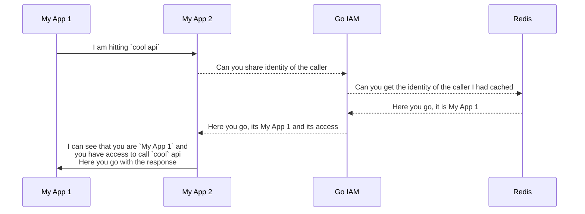
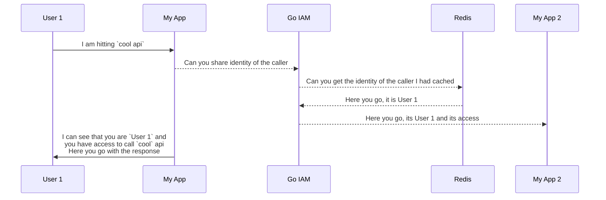

# Go IAM Fundamentals

Go IAM is a comprehensive **multi-tenant** Identity and Access Management system designed to provide flexible authentication and authorization for modern applications. This guide explains the core concepts and architecture that make Go IAM powerful and scalable.

## 🏢 Multi-Tenant Architecture

**Everything in Go IAM is multi-tenant by design.** This means you can easily create isolated environments called **projects**, where each project maintains its own separate ecosystem of:

- 🔐 **Auth Providers** - External authentication systems
- 👥 **Clients** - Your applications that need authentication
- 👤 **Users** - People who access your applications
- 🎭 **Roles** - Permission groups for users
- 📦 **Resources** - Protected items in your system

Each project operates in complete isolation, ensuring that data and configurations from one project never interfere with another. This makes Go IAM perfect for:

- **SaaS providers** serving multiple customers
- **Enterprise organizations** with multiple departments
- **Development teams** managing multiple applications
- **Agencies** handling various client projects

---

## 🔐 Authentication System

The authentication layer handles **who** can access your system by integrating with external identity providers and managing client applications.

### External Auth Providers

Go IAM connects to external authentication systems to verify user identities:

#### Currently Supported
- **🔍 Google, Microsoft, GitHub OAuth and OpenID Connect** - Full integration with common authentication systems

#### Extensible Architecture
The system is designed for easy extension to support additional providers like:
- Microsoft Azure AD
- OpenID Connect
- GitHub OAuth
- Facebook Login
- Custom SAML providers
- LDAP/Active Directory

### Client Management

For your applications that need authentication, you create **clients** in Go IAM:
Go IAM treats user and application as first class citizens. This means both users and applications can authenticate and get authorized to access resources. Applications use client credentials to authenticate themselves. Users use thrid party auth managers provided by Go IAM.



<Media src="/images/diagrams/appauth.svg" alt="Client Management Diagram"/>



<Media src="/images/diagrams/userauth.svg" alt="Client Management Diagram"/>

#### Key Features:
- **One-to-Many Mapping**: A single auth provider can serve multiple clients
- **Flexible Configuration**: Each client can have different settings and permissions
- **Secure Credentials**: Each client gets unique credentials for API access

### Special Client: Go IAM Self-Authentication

Go IAM includes a unique feature - **it can authenticate itself**:

- **Self-Contained**: Go IAM can provide authentication for its own admin interface
- **Bootstrap Security**: Essential for initial setup and ongoing administration
- **Single Setup**: This special client can only be configured in go iam deployment's lifecycle
- **Admin Access**: Provides secure access to the Go IAM management interface

---

## 🛡️ Authorization System

The authorization layer determines **what** authenticated users can access through a sophisticated resource and policy management system.

### Resource Management

A **resource** in Go IAM is any item that needs access control:

#### Resource Definition
- **Stable Identifier**: Must have an identifier that won't change
- **Flexible Scope**: Can represent anything from UI buttons to database records
- **Granular Control**: Each resource can be individually managed

#### Resource Examples:
```yaml
Resources:
  - id: "user-dashboard-button"
    type: "UI Element"
    description: "Main dashboard access button"
  
  - id: "api-users-create"
    type: "API Endpoint"
    description: "POST /api/users endpoint"
  
  - id: "db-user-record-123"
    type: "Database Record"
    description: "Specific user record in database"
  
  - id: "report-financial-q4"
    type: "Document"
    description: "Q4 Financial Report access"
```

### Access Control Methods

Resources can be assigned through two primary methods:

#### 1. 🎭 Role-Based Assignment
- Resources attached to roles
- Users inherit resource access through role membership
- Ideal for standard permission sets

#### 2. 📋 Policy-Based Assignment
- Resources directly assigned to users via policies
- More granular and flexible than roles
- Perfect for exceptions and special cases

### Automated Policy System

Go IAM includes three powerful automated policies that streamline resource management:

#### 1. 👤 User Creation Policy (Default)
```yaml
Policy: "Auto-assign resources to creator"
Trigger: When a user creates a resource
Action: Automatically attach the resource to the creating user
Use Case: Ensures creators always have access to their own resources
Status: Applied by default to all new users
```

**Example**: When a user creates a new button in their application and register it as a resource, they automatically get access it.

#### 2. 🔄 User-to-User Transfer Policy
```yaml
Policy: "Auto-assign to specific user"
Trigger: When any resource is created
Action: Automatically attach the resource to a designated user
Use Case: Central management or delegation scenarios
Configuration: Specify target user during policy setup
```

**Example**: All new customer records automatically get assigned to the customer service manager.

#### 3. 🎭 Role Assignment Policy
```yaml
Policy: "Auto-assign to role"
Trigger: When any resource is created
Action: Automatically attach the resource to a specified role
Use Case: Feature development and production readiness
Configuration: Specify target role during policy setup
```

**Example**: All new API endpoints automatically get assigned to the "Developer" role for testing.

### Resource Lifecycle Management

Understanding how resources are managed throughout their lifecycle:

#### Policy-Based Attachment
- ✅ **Persistent**: Resources attached via policies remain with users even when policies are removed
- 🔒 **Intentional**: Prevents accidental loss of access when policies change
- 📝 **Auditable**: Clear history of how users gained access to resources

#### Role-Based Attachment
- 🔄 **Dynamic**: Resources are automatically removed when roles are revoked
- 🛡️ **Safe**: Only removes access if no other roles or policies grant the same resource
- ⚡ **Immediate**: Changes take effect instantly when role membership changes

#### Example Scenario:
```yaml
User: "Alice"
Initial State:
  - Role: "Editor" (includes resource-A, resource-B)
  - Policy: Direct access to resource-A

Action: Remove "Editor" role from Alice

Result:
  - resource-A: ✅ Still accessible (granted via policy)
  - resource-B: ❌ Access removed (no other grants exist)
```

---

## 🔮 Future Roadmap

### Custom Policies
Plans are underway to support **custom policies** that will allow:
- **Business Logic Integration**: Policies based on custom business rules
- **External System Integration**: Policies that consider external data sources
- **Time-Based Access**: Temporary or scheduled resource access
- **Conditional Logic**: Complex if-then scenarios for resource assignment

### Additional Features
- **Advanced Audit Logging**: Comprehensive access and change tracking
- **API Rate Limiting**: Built-in protection against abuse
- **SSO Integration**: Single Sign-On with popular enterprise systems
- **Mobile SDK Support**: Native mobile application integration

---

## 🎯 Best Practices

### Project Organization
- **Separate Environments**: Use different projects for development, staging, and production
- **Logical Grouping**: Group related applications and users within projects
- **Clear Naming**: Use descriptive names for all resources and roles

### Security Guidelines
- **Principle of Least Privilege**: Grant minimum necessary access
- **Regular Audits**: Periodically review user permissions and resource assignments
- **Policy Documentation**: Document the purpose of each custom policy
- **Role Hierarchy**: Design clear role structures that reflect your organization

### Performance Optimization
- **Resource Granularity**: Balance between security and performance when defining resources
- **Caching Strategy**: Leverage Go IAM's caching for frequently accessed permissions
- **Batch Operations**: Use bulk operations for large-scale permission changes

This comprehensive foundation ensures that Go IAM can scale with your needs while maintaining security and flexibility across all your projects and applications.